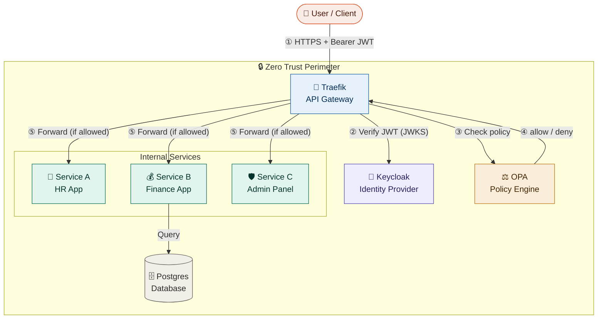
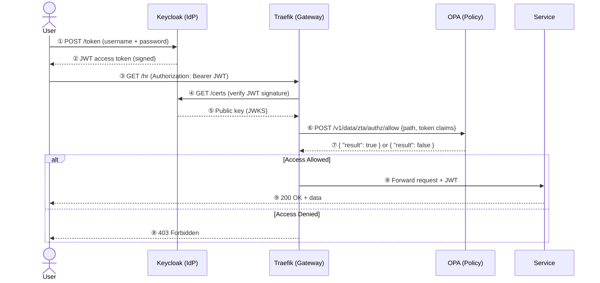
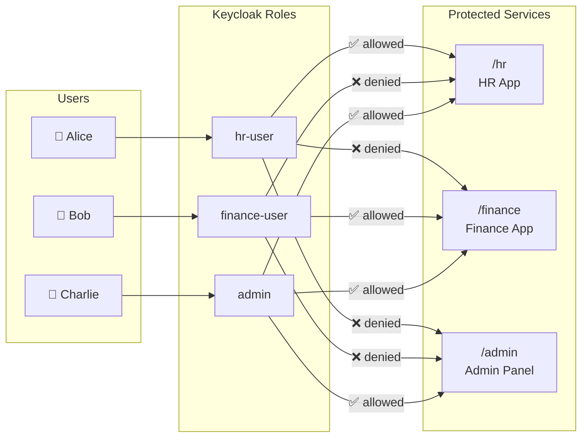
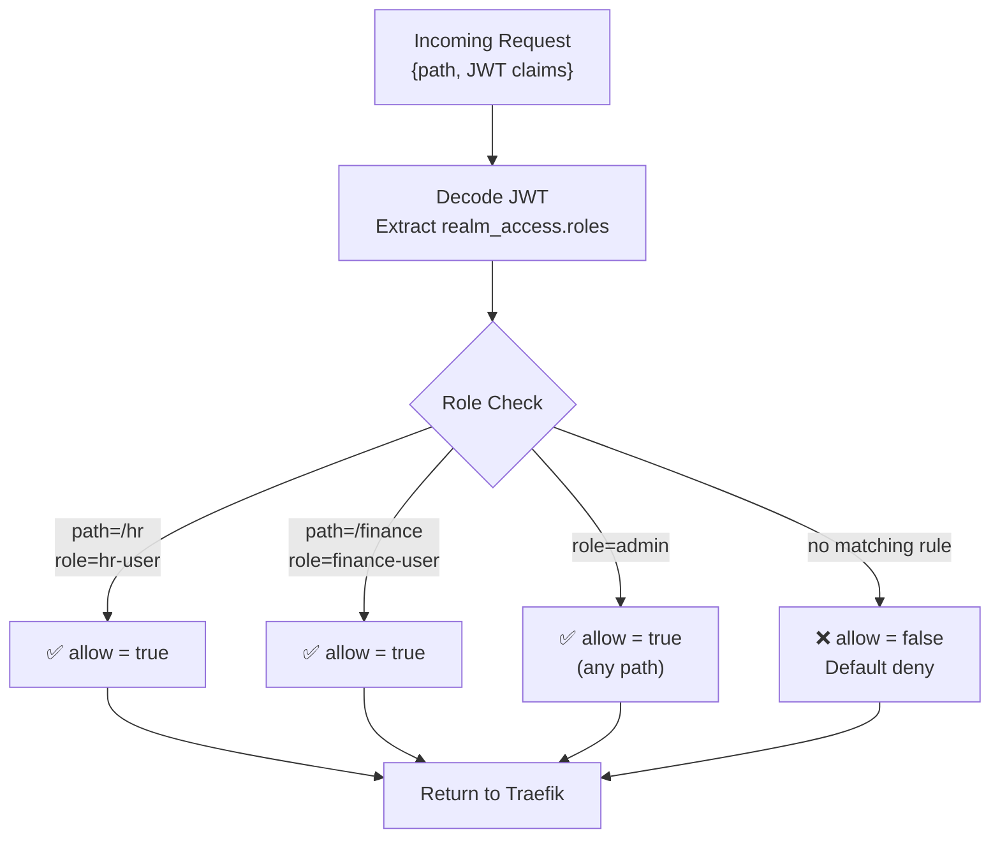
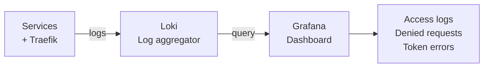
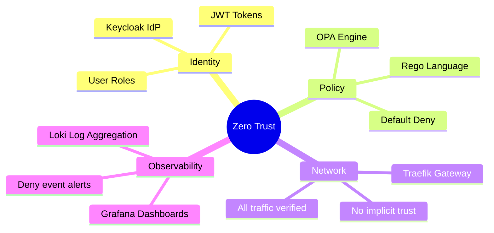

# 🔐 Zero Trust Architecture (ZTA) Simulation

> A hands-on simulation of an enterprise Zero Trust Architecture using Docker, Keycloak, OPA, and Traefik. Every request is verified. No implicit trust — ever.

---

## 📋 Table of Contents

- [What is Zero Trust?](#what-is-zero-trust)
- [Architecture Overview](#architecture-overview)
- [Component Breakdown](#component-breakdown)
- [Authentication & Authorization Flow](#authentication--authorization-flow)
- [Role-Based Access Control](#role-based-access-control)
- [Project Structure](#project-structure)
- [Prerequisites](#prerequisites)
- [Quick Start](#quick-start)
- [Testing the System](#testing-the-system)
- [OPA Policy Logic](#opa-policy-logic)
- [Observability](#observability)
- [Troubleshooting](#troubleshooting)
- [Roadmap](#roadmap)

---

## What is Zero Trust?

Traditional security assumed that everything **inside** the corporate network was safe. Zero Trust throws that assumption away.

> **"Never trust, always verify."**

The three core principles this simulation demonstrates:

| Principle | What it means | How we implement it |
|---|---|---|
| **Never trust, always verify** | Every request must carry a valid, verified token | Traefik validates JWT on every request |
| **Least privilege** | Users only access what they're explicitly allowed | OPA policies tied to Keycloak roles |
| **Assume breach** | Log and monitor everything | Grafana + Loki observability stack |

---

## Architecture Overview

```
┌─────────────────────────────────────────────────────────────────────┐
│                        Zero Trust Perimeter                          │
│                                                                       │
│   ┌──────────┐    ┌──────────────┐    ┌─────┐    ┌──────────────┐  │
│   │ Traefik  │───▶│   Keycloak   │    │ OPA │    │   Postgres   │  │
│   │ Gateway  │    │     IdP      │    │     │    │   Database   │  │
│   └────┬─────┘    └──────────────┘    └──┬──┘    └──────────────┘  │
│        │  verify JWT ◀──────────────────▶│                           │
│        │  check policy ────────────────▶ │                           │
│        │                                 │                           │
│   ┌────▼──────────────────────────────┐  │                           │
│   │           Internal Services        │  │                           │
│   │  ┌──────────┐  ┌──────────┐  ┌──────────┐                      │
│   │  │ Service A │  │ Service B │  │ Service C │                     │
│   │  │  HR App  │  │ Finance  │  │  Admin   │                      │
│   │  └──────────┘  └──────────┘  └──────────┘                      │
│   └───────────────────────────────────────────┘                     │
└─────────────────────────────────────────────────────────────────────┘
         ▲
         │  HTTPS + Bearer JWT
         │
    ┌────┴─────┐
    │  Client  │  (Browser, curl, app)
    └──────────┘
```

---

## Architecture Diagram (Mermaid)



---

## Component Breakdown

### 🔀 Traefik — API Gateway
- The **single entry point** for all traffic
- Intercepts every request and enforces authentication middleware
- Routes traffic to the correct backend service based on URL path
- Integrates with OPA via `forwardAuth` middleware

### 🔑 Keycloak — Identity Provider (IdP)
- Issues **JWT access tokens** upon successful login
- Manages users, roles, and clients
- Exposes a JWKS endpoint so Traefik can verify token signatures
- Handles token refresh and expiry

### ⚖️ OPA — Policy Engine
- The **authorization brain** of the system
- Receives structured input (JWT claims + request path) and returns `allow: true/false`
- Policies are written in Rego — a declarative language
- Completely decoupled from your services (change policies without redeploying apps)

### 📦 Microservices (A, B, C)
- Small FastAPI apps simulating real organization departments
- They **trust no one** — they re-verify the JWT even after Traefik forwards the request
- Each service enforces its own second layer of policy checks

---

## Authentication & Authorization Flow



---

## Role-Based Access Control



| User | Password | Roles | Can Access |
|------|----------|-------|------------|
| `alice` | `alice123` | `hr-user` | `/hr` only |
| `bob` | `bob123` | `finance-user` | `/finance` only |
| `charlie` | `charlie123` | `admin` | Everything |

---

## Project Structure

```
zta-simulation/
│
├── 📄 docker-compose.yml          # Orchestrates all services
│
├── 📁 traefik/
│   └── traefik.yml                # Gateway routing + middleware config
│
├── 📁 keycloak/
│   └── realm-export.json          # Pre-configured realm, users & roles
│
├── 📁 opa/
│   └── policy.rego                # Authorization policies (Rego language)
│
├── 📁 service-a/                  # HR App
│   ├── main.py
│   └── Dockerfile
│
├── 📁 service-b/                  # Finance App
│   ├── main.py
│   └── Dockerfile
│
└── 📁 service-c/                  # Admin Panel
    ├── main.py
    └── Dockerfile
```

---

## Prerequisites

| Tool | Version | Install |
|------|---------|---------|
| Docker | 24+ | [docker.com](https://www.docker.com/get-started) |
| Docker Compose | v2+ | Included with Docker Desktop |
| Git | any | [git-scm.com](https://git-scm.com) |
| curl + jq | any | `sudo apt install curl jq` |

---

## Quick Start

```bash
# 1. Clone the repository
git clone https://github.com/your-username/zta-simulation.git
cd zta-simulation

# 2. Start all services
docker compose up --build

# 3. Wait ~90 seconds for Keycloak to initialize
docker compose logs -f keycloak   # wait for "Listening on: http://0.0.0.0:8080"

# 4. Verify everything is running
docker compose ps
```

### Service URLs

| Service | URL | Credentials |
|---------|-----|-------------|
| Traefik Dashboard | http://localhost:8080 | — |
| Keycloak Admin | http://localhost:8180 | admin / admin |
| OPA API | http://localhost:8181 | — |
| Grafana | http://localhost:3000 | admin / admin |

---

## Testing the System

### Get a Token

```bash
# As Alice (hr-user)
TOKEN=$(curl -s -X POST \
  http://localhost:8180/realms/zta-org/protocol/openid-connect/token \
  -d "client_id=zta-client" \
  -d "client_secret=zta-secret-123" \
  -d "username=alice" \
  -d "password=alice123" \
  -d "grant_type=password" | jq -r .access_token)

echo "Token: $TOKEN"
```

### Test Access Control

```bash
# ✅ Alice accessing HR — should return 200
curl -H "Authorization: Bearer $TOKEN" http://localhost/hr

# ❌ Alice accessing Finance — should return 403
curl -H "Authorization: Bearer $TOKEN" http://localhost/finance

# ❌ No token — should return 401
curl http://localhost/hr

# Get token as Charlie (admin) — can access everything
ADMIN_TOKEN=$(curl -s -X POST \
  http://localhost:8180/realms/zta-org/protocol/openid-connect/token \
  -d "client_id=zta-client" \
  -d "client_secret=zta-secret-123" \
  -d "username=charlie" \
  -d "password=charlie123" \
  -d "grant_type=password" | jq -r .access_token)

# ✅ Admin accessing everything
curl -H "Authorization: Bearer $ADMIN_TOKEN" http://localhost/hr
curl -H "Authorization: Bearer $ADMIN_TOKEN" http://localhost/finance
curl -H "Authorization: Bearer $ADMIN_TOKEN" http://localhost/admin
```

### Expected Responses

```
GET /hr (Alice)       → 200 {"data": "HR records", "user": "alice"}
GET /finance (Alice)  → 403 {"detail": "Access denied by policy"}
GET /hr (no token)    → 401 {"detail": "Missing token"}
GET /admin (Charlie)  → 200 {"data": "Admin panel", "user": "charlie"}
```

---

## OPA Policy Logic



The policy file (`opa/policy.rego`):

```rego
package zta.authz

import future.keywords.if
import future.keywords.in

# Default: deny everything
default allow = false

roles := input.token.realm_access.roles

# HR users → /hr only
allow if {
    input.path == "/hr"
    "hr-user" in roles
}

# Finance users → /finance only
allow if {
    input.path == "/finance"
    "finance-user" in roles
}

# Admins → unrestricted access
allow if {
    "admin" in roles
}
```

---

## Observability

Every access attempt — allowed or denied — is logged. The observability stack:



Access Grafana at **http://localhost:3000** to see:
- All incoming requests with user identity
- Policy denial events (who tried to access what)
- Token validation failures
- Service response times

---

## Troubleshooting

| Problem | Likely Cause | Fix |
|---------|-------------|-----|
| `Connection refused` on Keycloak | Still starting up | Wait 90s, run `docker compose logs keycloak` |
| `invalid_client` on token request | Wrong client secret | Check `client_secret` matches `realm-export.json` |
| `404` from OPA | Wrong package path | Ensure `package zta.authz` matches URL `/v1/data/zta/authz/allow` |
| Services can't reach each other | Using `localhost` inside container | Use container names: `http://keycloak:8080`, not `localhost:8180` |
| JWT signature verification fails | Wrong realm name in JWKS URL | URL must match realm: `/realms/zta-org/protocol/openid-connect/certs` |

---

## Roadmap

- [x] JWT authentication via Keycloak
- [x] Policy enforcement via OPA
- [x] Role-based access (hr-user, finance-user, admin)
- [x] Traefik API Gateway routing
- [ ] mTLS between internal services
- [ ] Redis token cache (reduce Keycloak load)
- [ ] Rate limiting per user in Traefik
- [ ] Istio service mesh for automatic mTLS
- [ ] Simulated attacker container
- [ ] CI/CD pipeline with automated policy tests

---

## Key Concepts Recap



---

## License

MIT — use freely for learning and experimentation.

---

*Built as a learning project to simulate enterprise Zero Trust Architecture principles using open-source tooling.*
